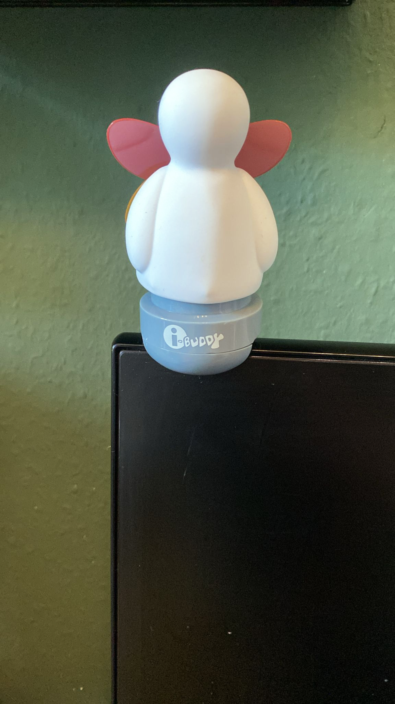

Maker Media GmbH

***

# ESP32-S3 als USB-Host

**Der ESP32-S3 kann dank seines USB-OTG-Controllers auch als Host arbeiten. Wir zeigen, wie sich damit ein altes USB-Gadget direkt ansteuern lässt und erklären, wie USB-Control-Transfers, HID-Requests und die Host-Bibliothek der ESP-IDF zusammenspielen.**

Der vollständige Artikel zum Projekt steht in der **[Make-Ausgabe 5/26 ab Seite 106](https://www.heise.de/select/make/2026/5)**.
